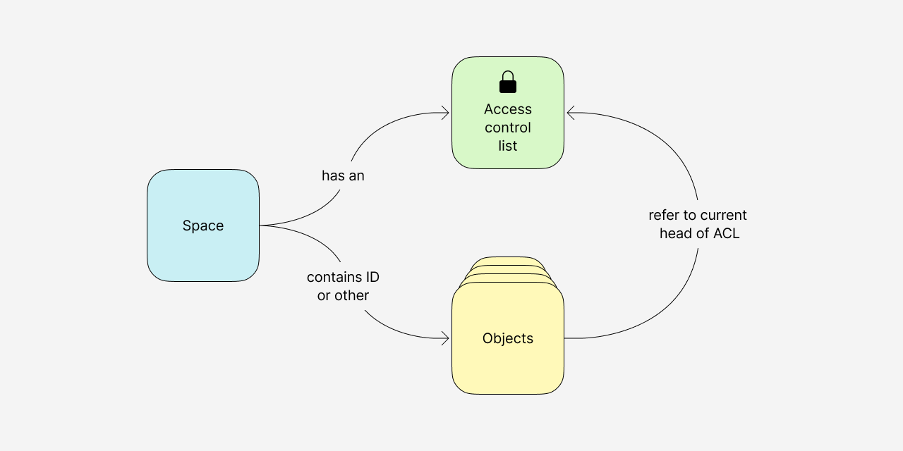
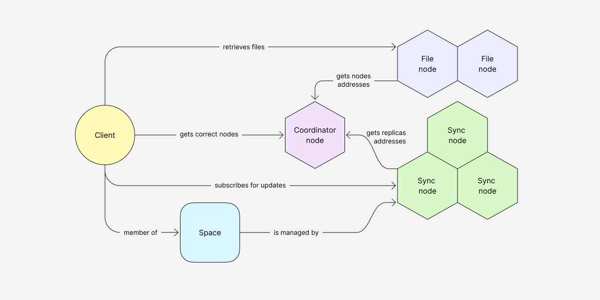
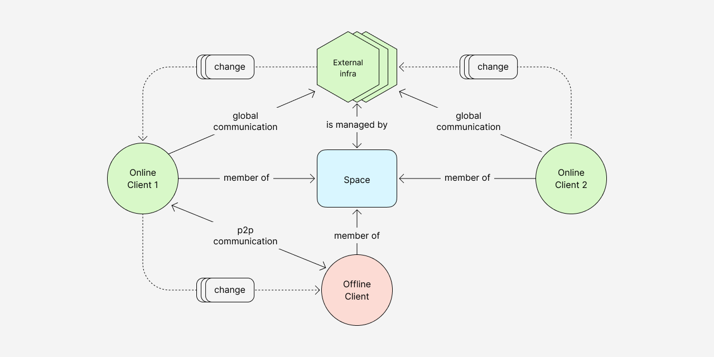

# 协议概述

Any-Sync 是一种开源协议，旨在创建高性能、本地优先、点对点、端对端加密的应用程序，促进多个用户和设备之间的无缝协作。

通过使用该协议，用户可以放心地保留对其数据和数字体验的完全控制。他们有权在不同的服务提供商之间自由转换，甚至选择自行托管应用程序。

这确保了用户在管理个人信息和数字互动方面的最大灵活性和自主性。

### Introduction

现有的大多数信息管理工具都是在集中式客户服务器架构上实施的，或者是为离线单用户使用而设计的。无论哪种方式，用户都需要做出权衡：他们可能会面临自由受限和隐私被侵犯的问题，或者为了避免这种情况而在工具功能上做出妥协。

我们认为这有悖于基本的数字自由，因此需要新一代软件来尊重这些自由，同时提供一流的用户体验。

我们对 `any-sync` 的目标是开发一种协议，使这种软件的部署成为可能。

Features:

* 跨多个设备和代理进行无冲突数据复制
* 内置端到端加密功能
* 可加密验证的更改历史记录
* 适应频繁操作（高性能）
* 可靠、可扩展的基础设施
* 同时支持 p2p 和远程通信

### 协议解释

#### 数据表示

_**对象**_

`any-sync` 旨在同步结构为[无冲突复制数据](https://en.wikipedia.org/wiki/Conflict-free\_replicated\_data\_type) [有向无环图](https://en.wikipedia.org/wiki/Directed\_acyclic\_graph) (DAGs) 的数字对象。在这种表示法中，每个对象都被视为根，代表其初始状态，并捕捉对象随时间发生的所有后续变化。简单地说，在 "同步 "中，对象是相关变化的完整历史的全面记录。

后面没有变化的变化是对象头。

_**冲突解决**_

`any-sync` 专门设计用于支持多个设备和代理之间的协作，这可能会导致对象具有多个`头`的情况。 在这种情况下，头指的是所涉及的每个设备或代理观察到的对象的本地状态。

当用户对具有多个头的对象进行更改时，新的更改将合并并引用所有这些头。 此过程有效地将多个分支`合并`在一起，从而为对象带来统一且单一的状态。

在检索对象当前状态的过程中，协议以特定头开始，并遵循内容 ID (CID) 来构造更改序列。 如果有多个头或多种可能的方式来识别先前的变化，则采用拓扑排序。 这种排序依赖于与更改相关的哈希值来确定更改发生的顺序，最终建立正确的更改序列。

_**快照**_

为了提高检索当前状态的效率，`any-sync` 所采用的协议使用基于概率的机制，将更改转换为快照。创建快照后，就不再需要分析在此之前发生的更改，以重建对象的当前状态。这样的优化通过在快照可用时跳过对前面更改的分析，实现了更快速的检索。

`any-sync` 是一个独立于特定客户端实现的协议，使其成为客户端不可知。它提供了遍历对象的机制，允许应用程序根据通过协议接收到的对象构建自己的应用状态。换句话说，使用 `any-sync` 的应用程序可以利用从中收到的对象构建自己的内部状态，以满足特定的需求和功能。

_**文件**_

`any-sync` 的文件处理是一个两部分的解决方案：数据存储和数据检索。

它使用 [IPLD](https://ipld.io/) 数据结构来存储文件的数据。文件可以存储在用户设备上，也可以存储在外部网络上的文件节点上，这意味着协议可以与简单网络拓扑一起工作。

`any-sync` 同之前的 [bitswap](https://docs.ipfs.tech/concepts/bitswap/) 相比有自己独特的文件检索方式，其适用于复杂网络拓扑。

_**空间**_

空间是一个带有访问控制列表 (ACL) 的数字对象集合，用户可以定义谁可以读取和修改其内容。

在最简单的情况下，每个空间都保存一个用户的数据，可以从该用户的多个设备访问该空间。但是，在多个代理在同一个空间中协作的情况下，空间将存储有权访问其数据的每个用户设备上的数据。在这些情况下，访问和管理空间内数据的权限由 ACL 确定。

空间可以存储在用户设备上，也可以存储在外部网络上的同步节点上。

_**加密**_

每个用户都有用于签名、加密和解密的私钥和公钥。

`any-sync` 使用 [Ed25519](https://en.wikipedia.org/wiki/EdDSA) 算法进行签名，以提供强大的加密安全性，同时保持性能开销较低。

每当用户修改数据时，使用他们自己的私钥对更改进行加密和签名。当这些更改与其他设备或同步节点同步时，将使用共享的公钥进行验证。然而，只有拥有私钥的用户才能访问这些更改的内容。

#### 基础设施

虽然 `any-sync` 在用户的设备和本地p2p网络上运行，但需要基础设施层来提供外部数据存储和备份，以及不同网络中代理之间的无缝协作。

`any-sync`协议在用户的设备和基础设施数字上的运行方式相同。因此，每个节点都可以看作是一个对等节点。

_**节点**_\
基础设施方面包括三种类型的节点：同步节点、文件节点和协调器节点。

* _同步节点_ 存储和处理空间。为了提高基础设施的可靠性，每个空间由多个同步节点提供服务。
* _文件节点_ 根据 IPLD 数据结构存储和处理文件。
* _协调器节点_ 负责存储和更新基础设施配置：它管理节点列表，为客户端提供空间节点的地址，为节点提供副本的地址等。

_**负载分配**_

[负载分配](https://github.com/anyproto/go-chash) 是通过模块化哈希和一致性哈希的组合来实现的。该算法使用一致性哈希在节点间分布分区（空间组），然后使用模块化哈希确定空间分区（从而确定空间的节点）。

该算法限制了节点上的负载，使分配更加均匀。

添加新节点会导致基础设施配置发生变化。此事件启动了重分片处理过程，根据新配置将空间及其数据在节点之间传输。

#### 对等节点检索

_**本地p2p**_

为了在本地网络中找到对等节点并与它们进行通信，无需连接到外部基础设施，`any-sync` 依赖于 [mDNS 协议](https://en.wikipedia.org/wiki/Multicast\_DNS)。

用户设备发送一个 mDNS 查询，请求具有特定主机名的设备的 IP 地址。网络上具有该主机名的其他设备将使用它们的 IP 地址进行响应。

一旦客户端获得同级设备的 IP 地址，`any-sync` 尝试检索此设备上存在的空间。

如果当前用户可以访问同级设备上的空间（基于空间ACL），则开始常规消息交换。

同级设备上存储的文件也可以直接从上面检索。

这允许同一网络上的设备之间进行高效且直接的通信，无需远程服务器或互联网连接。

_**全球网络**_

用户设备上的 `any-sync` 存储有外部基础设施地址的配置。它请求协调器节点为用户分配的空间的同步节点的地址。

一旦客户端接收到空间节点的地址，它订阅更新并将更改发送给它。

在外部基础设施上存储的文件可以从文件节点中检索。

此外，如果用户在同一局域网中有两台安装有`any-sync`的设备，则可以使用混合模式。比方说，第一台设备可以访问外部基础设施，而第二台设备不能访问。

在这种情况下，第一台设备作为桥接设备。它与本地对等方交换数据，并将第二台设备上所做的更改转换为外部存储。

它还可以反过来工作：当第一台设备从远程同步节点接收更新时，它通过本地p2p连接将这些更新发送到第二台设备。

### 开发背景

我们了解到开发和维护一个全新协议的重要性，并在仔细考虑现有解决方案之后做出了这个决定。

我们评估了如 RGA、Logoot、LSEQ、Automerge 等算法的实现。尽管它们在数据表示方面有类似的想法，如对象操作的逻辑排序，但它们不提供内容标识符和加密方案。

此外，它们还设计用于处理纯文本数据，而any-sync 依赖于二进制格式来支持复杂数据结构。

因此，我们设计了符合我们需求的数据结构。值得注意的是，前述解决方案中没有一个支持混合网络，这将需要我们在它们之上构建一些东西。

我们还考虑过使用 IPFS，但其对内容标识符的处理方式并不能满足我们的使用场景。虽然 IPFS 可以解决我们对混合网络的需求，但它使用 CID 来描述文档，并且这个 CID 会随着每次修改而发生变化。然而，我们需要让文档具有稳定的标识符，以便于链接以及其他目的。

在 IPFS 之上创建稳定的标识符并实现合并不同文档状态的逻辑过于复杂，因此我们选择了一种更简单的方法。

### 下一步计划

我们很高兴向社区宣布 `any-sync` 项目的早期开发阶段。

在即将到来的开发阶段，我们计划实现以下重要功能：

* 支持多代理机制的完全访问控制列表（ACL）： 通过为同步过程中涉及的不同代理提供全面的访问权限和特权控制，这个改进将实现复杂数字协作场景。
* 多服务提供商支持：我们打算引入对多个服务提供商的支持，促进不同远程基础设施之间的无缝通信。这个功能将提高互操作性，使用户能够在各种基础设施提供商之间进行连接和协作。
* 全球端到端（p2p）通信： `any-sync` 将进行优化，使设备之间无需远程基础设施即可直接通信和连接。这项改进将使用户能够建立直接的 p2p 连接，加快数据同步速度，提高效率。

我们致力于不断完善 `any-sync`，并很高兴在不久的将来实现这些激动人心的功能，为社区带来更多好处。

